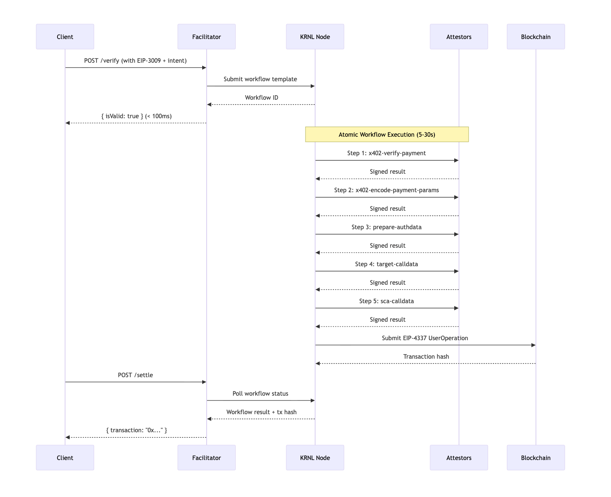

# KRNL-Enhanced X402 Facilitator 

Next-generation x402 payment facilitator featuring **atomic verify+settle** workflows powered by KRNL Protocol.

## Contents

- [What Makes This Different?](#what-makes-this-different)
- [Features](#features)
- [Quick Start](#quick-start)
- [Facilitator API](#facilitator-api-overview)
- [EigenAI Agent](#eigenai-agent-usage)
- [How It Works](#how-it-works)
- [Client Integration](#client-integration)
- [Project Structure](#project-structure)
- [Documentation](#documentation)
- [Performance](#performance)
- [Troubleshooting](#troubleshooting)
- [License](#license)
- [Contributing](#contributing)
- [Links](#links)

## 🎯 What Makes This Different?

### KRNL Protocol Enhancement

Unlike traditional x402 facilitators that handle verification and settlement separately, this system performs **both operations atomically** through KRNL blockchain workflows:

**Traditional Flow:** `Verify → Serve Resource → Settle` (3 separate steps)
**KRNL-Enhanced Flow:** `Start Atomic Workflow → Serve Resource → Get Result` (1 atomic operation)

**KRNL Protocol Benefits:**
- 🔐 **Atomic execution** - Settlement guaranteed with verification
- 🛡️ **Trustless** - Each step cryptographically signed by an attestor
- 💰 **Gas optimized** - EIP-4337 bundled transactions
- 🔗 **Verifiable** - Complete audit trail with on-chain receipts

### EIP-4337 Smart Account Innovation

This implementation leverages **EIP-4337 (Account Abstraction)** to solve critical limitations of traditional facilitators:

#### Flexible Gas Payment

**Traditional Facilitator Problem:**
- Facilitator must pay gas for settlement transactions
- Requires facilitator to maintain ETH balance on all chains
- Creates trust assumption: facilitator has funds and won't manipulate settlement
- Communication between server/facilitator could be tampered with
- Single point of failure if facilitator runs out of gas

**EIP-4337 Solution:**
- ✅ **Agent pays own gas** - Smart accounts can hold ETH and self-sponsor
- ✅ **Server-side gas sponsorship** - Paymasters enable gasless UX without facilitator involvement
- ✅ **Trustless execution** - No need to trust facilitator has gas or won't manipulate
- ✅ **Flexible payment** - Gas can be paid in ERC-20 tokens (e.g., pay gas in USDC)
- ✅ **Decoupled architecture** - Settlement happens independently of facilitator balance

#### Native Multi-chain Support

**Traditional Facilitator Limitation:**
- Each chain requires separate EOA private key management
- Different nonce tracking per chain
- Complex cross-chain state synchronization

**EIP-4337 Multi-chain Benefits:**
- ✅ **Unified interface** - One account abstraction standard works everywhere
- ✅ **Chain-agnostic workflows** - KRNL workflows deploy identically on any EVM chain
- ✅ **Out-of-the-box support** - Ethereum, Base, Optimism, Arbitrum, Polygon (any EVM chain)

## ✨ Features

### KRNL Facilitator
- **Atomic Settlement**: KRNL workflow-powered verify+settle operations
- **EIP-4337 Integration**: Smart account wallets and gasless transactions
- **Verifiable Workflows**: Each step cryptographically signed and traceable


## 🚀 Quick Start

### Prerequisites

**For Facilitator:**
- **Node.js** v18+
- **ngrok** for local development (KRNL needs to reach your facilitator)
- **Test funds**: Base Sepolia ETH + USDC
- **API Keys**: Pimlico bundler/paymaster for EIP-4337

### Installation

```bash
git clone <your-repo>
cd krnl-x402
npm install
cp .env.example .env
# Edit .env with your configuration
```

### Essential Configuration

```bash
# .env
RPC_URL=https://sepolia.base.org
KRNL_NODE_URL=https://node.krnl.xyz
BUNDLER_URL=https://api.pimlico.io/v2/base-sepolia/rpc?apikey=YOUR_KEY
PAYMASTER_URL=https://api.pimlico.io/v2/base-sepolia/rpc?apikey=YOUR_KEY
FACILITATOR_URL=https://your-ngrok-url.ngrok-free.app
```

See **[Deployment Guide](./DEPLOYMENT_GUIDE.md)** for complete configuration options.

### Development Setup

1. **Start ngrok** (for KRNL to reach your facilitator):
   ```bash
   ngrok http 3000
   # Copy the ngrok URL and update FACILITATOR_URL in .env
   ```

2. **Start the facilitator**:
   ```bash
   npm run dev
   ```

3. **Test the setup**:
   ```bash
   curl https://YOUR_NGROK_URL/facilitator/supported
   ```

### Production Deployment

For production deployment options including Railway, Fly.io, AWS, and others, see the **[Deployment Guide](./DEPLOYMENT_GUIDE.md)**.

## 🔧 Facilitator API Overview

| Endpoint | Method | Description |
|----------|--------|-------------|
| `/facilitator/verify` | POST | Start atomic KRNL workflow, return immediately |
| `/facilitator/settle` | POST | Get workflow result (waits up to 30s) |
| `/facilitator/supported` | GET | List supported networks |
| `/health` | GET | Health check |

**Atomic Workflow Flow:**
1. `POST /verify` → Starts KRNL workflow → `{ isValid: true }` (< 100ms)
2. Background: KRNL executes verifiable workflow steps (5-30s)
   - `x402-verify-payment` - Validates EIP-3009 signature
   - `x402-encode-payment-params` - Encodes USDC authorization
   - `prepare-authdata` - Prepares attestor signatures
   - `target-calldata` - Generates settlement calldata
   - `sca-calldata` - Prepares EIP-4337 UserOperation
3. `POST /settle` → Returns cached result → `{ transaction: "0x..." }`

## 🤖 EigenAI Agent Usage

See the [EigenAI Overview](https://docs.eigencloud.xyz/products/eigenai/concepts/eigenai-overview) for core EigenAI concepts and terminology.

### What is EigenAI?

EigenAI is a verifiable AI inference network that lets you build applications on top of LLMs **without wondering if the same call will behave differently on each run**, or if prompts/models/responses are being modified in-flight. EigenAI offers:

In this repository, EigenAI is the AI client for the agent that understands monitors KRNL workflows, and decides when to call the when to access the content/data from the premium content server.

### Starting the Agent

```bash
cd eigenai-agent
npm install
cp .env.example .env
# Configure EigenAI and wallet settings in .env
npm run dev
```


## 🏗️ How It Works

**Traditional x402:** `Verify Signature → Settle Later`
**KRNL x402:** `Start Atomic Workflow → Return Immediately → Background Settlement`

### Sequence Diagram



**KRNL Advantages:**
- **Non-blocking**: Verify returns immediately while workflow executes
- **Atomic**: All steps execute or none do - no partial states
- **Verifiable**: Each step is cryptographically signed by attestors
- **Trustless**: No need to trust the facilitator - verify on-chain
- **Reliable**: Guaranteed settlement with cryptographic proofs

**Gas Payment Model (EIP-4337):**

The EIP-4337 UserOperation submitted in the final step can be sponsored in multiple ways:

1. **Agent Self-Sponsorship**
   ```
   Smart Account holds ETH → Pays own gas → No external dependencies
   ```

2. **Paymaster Sponsorship**
   ```
   Paymaster contract → Subsidizes gas → Gasless UX for agent
   ```

3. **ERC-20 Gas Payment**
   ```
   Smart Account pays gas in USDC/USDT → No ETH needed
   ```

**Key Difference from Traditional Facilitators:**
- ❌ Traditional: Facilitator pays gas → Must trust facilitator has funds
- ✅ KRNL + EIP-4337: Client/agent/server pays gas → No facilitator dependency
- ✅ Trustless: Settlement happens even if facilitator goes offline
- ✅ Secure: No risk of facilitator manipulating settlement to save gas

## 💻 Client Integration

### Payment Payload Structure

Clients must include KRNL intent fields alongside standard EIP-3009 authorization:

```typescript
interface ExtendedPaymentPayload {
  payload: {
    // Standard EIP-3009 authorization (USDC transferWithAuthorization)
    authorization: {
      from: string;        // Smart account address (EIP-4337)
      to: string;          // Recipient address
      value: string;       // Amount in USDC (e.g., "1000000" for $1)
      nonce: string;       // Random bytes32 nonce
      validAfter: string;  // Unix timestamp (usually "0")
      validBefore: string; // Unix timestamp (deadline)
    };
    signature: string;     // EIP-712 signature of authorization

    // Required KRNL intent fields for atomic workflow
    intentId: string;          // keccak256(smartAccount, nonce, deadline)
    intentSignature: string;   // EOA signature of transaction intent
    intentDeadline: string;    // Intent expiration (unix timestamp)
    intentDelegate: string;    // KRNL delegate/owner address
    intentTarget: string;      // Target contract for settlement
  };
}
```

### Integration Steps

1. **Generate Transaction Intent** (for KRNL workflow)
   ```typescript
   const intentId = keccak256(encodePacked(
     ['address', 'uint256', 'uint256'],
     [smartAccountAddr, nonce, deadline]
   ));
   const intentSignature = await eoaWallet.signTypedData({
     domain: { ... },
     types: { TransactionIntent: [...] },
     primaryType: 'TransactionIntent',
     message: { target, value, id, ... }
   });
   ```

2. **Create USDC Authorization** (EIP-3009)
   ```typescript
   const authorization = {
     from: smartAccountAddr,  // Smart account holds USDC
     to: recipientAddress,
     value: "1000000",         // 1.00 USDC
     nonce: randomBytes32(),
     validAfter: "0",
     validBefore: Math.floor(Date.now() / 1000) + 3600
   };
   const signature = await eoaWallet.signTypedData({
     domain: usdcDomain,
     types: { TransferWithAuthorization: [...] },
     message: authorization
   });
   ```

3. **Submit to Facilitator**
   ```typescript
   // Start atomic workflow
   const verifyRes = await fetch('/facilitator/verify', {
     method: 'POST',
     body: JSON.stringify({
       paymentPayload: { ...authorization, signature, ...intentFields },
       paymentRequirements: { asset: usdcAddress, ... }
     })
   });
   
   // Poll for result
   const settleRes = await fetch('/facilitator/settle', {
     method: 'POST',
     body: JSON.stringify({ nonce: authorization.nonce })
   });
   ```

### Agent Demo

The **agent demo** (`/eigenai-agent`) provides a complete reference implementation showing:
- Smart account setup (EIP-4337)
- Intent generation and signing
- USDC authorization with EIP-712
- OnlyBrains payment flow integration
- Real-time KRNL workflow tracking

Run `npm run test:client` in the root directory to start the agent demo and run `npm run test:server` in the root directory to run the server tests. For testing purpose use: `https://poc.platform.lat/x402` as `FACILITATOR_URL`.


## 📁 Project Structure

```
krnl-x402/
├── 📄 Documentation files (README, API_REFERENCE, etc.)
├── 🚀 index.ts                  # Main server entry
├── 📁 facilitator/              # x402 endpoints (verify, settle, supported)
├── 📁 lib/                      # Core libraries (KRNL client, workflow builder)
├── 📁 middleware/               # KRNL workflow integration
├── 📁 contracts/                # Smart contracts for settlement
├── 📁 x402/                     # Modified x402 SDK for KRNL support
├── 📁 eigenai-agent/            # EigenAI agent for test the e2e flow while acting as a client
└── 📁 test/                     # Test suites
```

## 🚀 Performance

- **Verify Response**: < 100ms (non-blocking)
- **Settlement Time**: 5-30 seconds (background)
- **Scaling**: Redis-ready for horizontal scaling
- **Throughput**: Handles concurrent payments efficiently

## 🛠️ Troubleshooting

### Common Issues

**502 Bad Gateway in workflow logs**
- KRNL executor can't reach facilitator
- Check ngrok is running and FACILITATOR_URL is correct

**Workflow timeouts**
- Check KRNL node status at https://node.krnl.xyz
- Verify RPC endpoint and bundler/paymaster config
- Ensure sufficient ETH for gas

**Missing workflow in settle**
- Server restarted (use Redis for persistence)
- Payment nonce mismatch between verify/settle calls

### Testing

```bash
# Test the facilitator endpoints
curl https://YOUR_NGROK_URL/facilitator/supported

# Run test suite
npm test
```

---

## 📄 License

MIT License - see [LICENSE](./LICENSE) for details.

## 🤝 Contributing

Contributions are welcome! Before opening a PR:

- **Read the architecture**: See [Architecture Overview](./ARCHITECTURE.md) for how the facilitator, KRNL workflows, test server, and EigenAI agent fit together.
- **Run the core flows locally**:
  - Facilitator: `npm run dev` (Fastify server on port 3000)
  - Test resource server: `npm run test:server` (Express x402 seller on port 4000)
  - Agent demo: `npm run test:client` (runs `eigenai-agent` as a CLI client)
- **Add/change behavior in the right place**:
  - Facilitator HTTP surface: `index.ts`, `facilitator/` handlers.
  - KRNL + workflow logic: `middleware/krnl-x402.ts`, `lib/workflow-*.ts`, `lib/krnl-client.ts`.
  - Client/EigenAI behavior: `eigenai-agent/` and `test/client-eoa-eip4337.ts`.
- **Keep tests and examples working**:
  - Update docs and examples if you change request/response shapes.
  - Run `npm test` and the agent demo flow before submitting changes.

## 🔗 Links

- **KRNL Protocol**: https://krnl.xyz
- **x402 Standard**: https://github.com/x402-protocol/x402
- **Issues**: Open a GitHub issue for support
